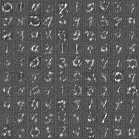
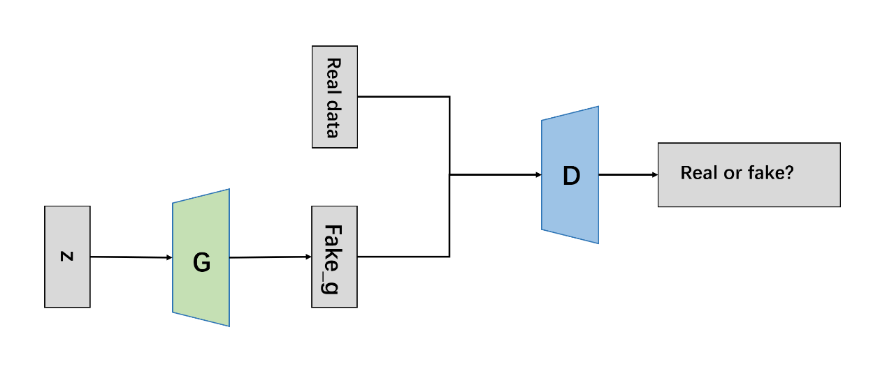
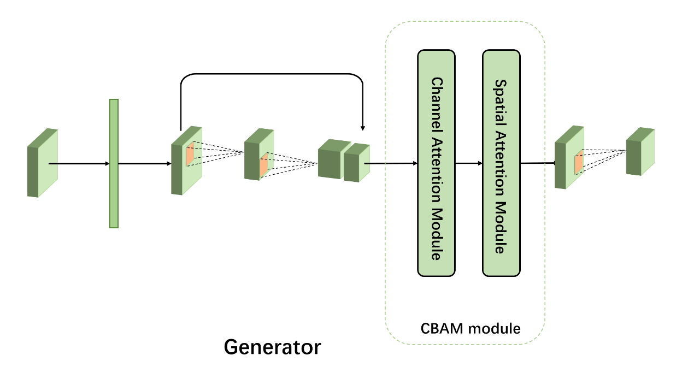

# Introduction

It is a GAN embedded with CBAM and SENet.
We trained it on mnist, fashion-mnist and a dataset of anime faces.

# Performance

On mnist dataset:

On fashion-mnist dataset:

On anime faces dataset:

# Architecture

# Requirement

- Linux
- Python 3.x
- Pytorch 1.11.0

# Download dataset

[Download anime faces dataset](https://drive.google.com/file/d/10KdDcdWPP_kd_tIcgPDzruxFiTIbrFQu/view?usp=sharing)

Unzip and move it into :
`./data/dataset_anime/data/faces`

# Quick Start

Train the model:

`nohup bash train.sh > ./logs/res.txt 2> ./logs/err.txt & `

or:

`python train.py --dataset mnist --gan_type gan --epoch 50 --batch_size 64 --use_cuda True`

The result will be saved in `./results/`